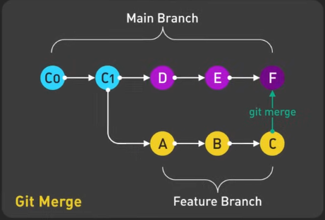
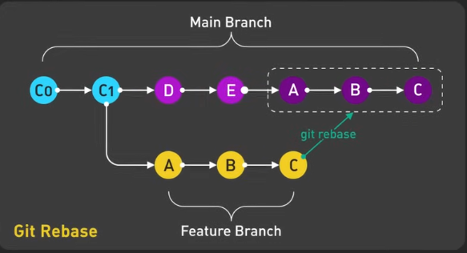

## 면접 Feedback
- 긴장한 티가 별로 안 나서 좋았음 (여유 있는 느낌)
- 전체적으로 답변이 긴 느낌이라 좀 더 간략하게 말하는 것이 좋을 듯

## 면접 질문 중 약했던 개념

### [핀터] 왜 병렬형 라우팅과 React Suspense가 동적 데이터를 고려한 것인가?

#### 병렬형 라우팅 (Parallel Routing)

- 여러 데이터 소스 동시에 처리
  - 페이지 내 다양한 영역(섹션)마다 별도의 데이터를 동적으로 불러와야 할 때, 각 영역을 각각의 라우트로 분리하여 병렬로 렌더링 처리
- 비동기 데이터 로딩 최적화
  - 모든 데이터를 한 번에 기다리지 않고, 준비된 섹션부터 곧바로 사용자에게 보여줄 수 있음
  - 이는 대기 시간을 감소시키고, 사용자 체감 속도를 크게 높여주는 효과
- UI 분할 및 경험 향상
  - 사용자가 일부 데이터만 먼저 받아 볼 수 있도록, UI를 영역 단위로 쪼개 비동기적으로(병렬로) 라우팅


#### React Suspense
- 데이터 패칭(loading) 상태 관리
  - Suspense를 사용하면 데이터가 준비되기 전까지 로딩 스피너 등 fallback UI를 제공할 수 있으므로, 데이터 fetch의 완성 여부에 따라 UI 상태를 명확하게 제어할 수 있음
- 동적 데이터 패칭과 렌더링 동기화
  - 컴포넌트를 렌더링할 때 Promise 기반의 데이터 패칭을 쉽게 통합
  - Suspense가 데이터를 기다렸다가, 데이터가 도착하면 자동으로 해당 컴포넌트를 렌더링
- 코드 분할과 데이터 분할
  - Suspense는 코드 스플리팅(lazy loading)뿐 아니라, 데이터 단위로도 로딩 제어가 가능해 동적 네트워크 환경에서 더 나은 유저 경험을 제공

#### 답변 다시 써보기

```text
해당 프로젝트는 "증시 커뮤니티"이다보니, 영역별로 다양한 데이터를 확인할 수 있어야 했습니다.
특히 메인 화면에서는 증시와 관련된 많은 데이터들이 포함되어 있었고, 이를 효과적으로 로딩해야 했습니다.
모든 데이터를 다 받아올 때가지 기다리기에는 화면 로딩 시간이 1초 이상 소요되어 사용자 경험이 나빠질 우려가 있었습니다.

이에 따라 ``병렬형 라우팅``을 도입했습니다.
병렬형 라우팅을 통해 페이지 내 주요 섹션을 여러 라우트로 분리한 뒤, 각 섹션에 필요한 데이터를 병렬로 불러올 수 있도록 구성했습니다.
이를 통해 다른 데이터는 백그라운드에서 계속 로딩되더라도, 사용자는 준비된 부분부터 즉시 사용할 수 있도록 즉각적인 화면을 제공했습니다.

또한, React Suspense를 통해 데이터 패칭 상태를 컴포넌트 단위에서 명확하게 관리했습니다.
데이터 로딩이 필요한 컴포넌트는 Suspense의 fallback UI를 Loading Indicator로 설정하여 사용자가 데이터를 불러오는 상태를 인지하고, 통일성있는 디자인을 제공하여 이탈율을 줄이고자 했습니다.
React Suspense를 사용함으로써 로딩/에러/성공 상태를 명확하게 관리할 수 있어 코드의 가독성 및 유지보수성이 향상되어 효과를 볼 수 있었습니다.  
```

### [핀터] 300건 병합 충돌 관련 → GitLab vs. Github 충돌 사유

#### GitLab과 GitHub이 병합 충돌을 일으키는 이유
- 두 브랜치가 같은 파일의 같은 부분을 서로 다르게 수정했을 때, Git이 자동으로 어떤 변경사항을 선택해야 할지 판단할 수 없게 되어 충돌이 발생
  - 두 사람이 동일한 파일의 동일한 라인 또는 인접한 라인을 다르게 수정한 경우
  - 한쪽 브랜치에서는 파일을 수정했지만 다른 쪽에서는 같은 파일을 삭제한 경우
  - 동일한 파일을 여러 사람이 동시에 수정하고 이를 병합할 때
  - 파일 이름 변경(rename) 등 복잡한 변경사항이 충돌을 유발할 때

#### rebase vs. merge commit

1. Merge Commit (병합 커밋)
   - 두 브랜치의 변경 사항을 합치면서 새로운 병합 커밋을 생성
   - 커밋 히스토리를 보존하며, 여러 개발자가 작업한 흐름을 그대로 보여줌
   - 병합 커밋은 두 부모 커밋을 가지며, 커밋 그래프가 다이아몬드 형태처럼 복잡해질 수 있음
   - 충돌이 발생하면 병합 시점에서 한 번에 해결
   - 장점: 작업 흐름과 히스토리가 명확히 남아 협업 상황 파악에 유리
   - 단점: 커밋 그래프가 복잡해지고, 히스토리가 직선적이지 않아 분석이 어려울 수 있음



2. Rebase (리베이스)
   - 한 브랜치의 커밋들을 다른 브랜치의 최신 커밋 위로 다시 "재배치"
   - 히스토리를 재작성하여, 커밋 히스토리를 선형으로 만듬
   - 기존 커밋이 새로운 커밋으로 바뀌므로 커밋 해시가 변경되고, 이를 통해 깔끔한 히스토리를 유지
   - 충돌이 발생하면 각 커밋마다 순차적으로 해결
   - 장점: 히스토리가 깔끔하고 직선적이라 추적과 이해가 쉬움
   - 단점: 공개된 브랜치에서 사용하면 협업에 혼란을 줄 수 있으며, 히스토리가 변경되므로 주의가 필요



#### 답변 다시 써보기

```text
해당 이슈는 기존 개발팀과 새롭게 투입된 저희 팀의 버전 관리 툴 및 컨벤션 차이에서 발생했습니다.
저희 팀은 GitHub 기준으로 rebase를 통해 버전 관리를 진행하여, 선형 히스토리 구조를 유지함으로 개발 진행 상황의 추적과 이해가 용이하도록 하였습니다.
한편 기존 개발팀은 merge commit을 통해 여러 개발자가 작업한 흐름을 그대로 보존하는 방식을 채태하였습니다.

개발이 점점 진행됨에 따라 저희팀은 지속적으로 rebase 과정을 통해 부모 커밋을 업데이트했으나, 기존 개발팀은 merge commit을 유지하였습니다.
이로 인해 브랜치 간 기준 커밋(base commit)이 점점 달라져 병합 충돌이 누적되는 현상이 발생했고, 격주마다 저희들의 개발 내용을 병합할 때 동일한 충돌이 반복 발생하엿습니다.
특히 기존 내역들을 병합할 때 기존 개발팀의 보안 및 관리 정책상 커밋 히스토리를 보존하지 않고 squash merge를 진행했기 때문에 병합 충돌이 중복하여 발생되고 있다는 확신을 가지기까지 많은 확인과 검증이 필요했습니다.

이를 해결하기 위해 저희는 새로운 병합 시 기존 개발팀의 브랜치를 rebase하여 커밋 기반을 동기화함으로써, 과거 충돌이 반복 발생하는 문제를 완화했고, 충돌 해결 작업의 중복을 크게 줄일 수 있었습니다.
추가적으로 공통 커밋 메시지 규칙, 브랜치 네이밍, PR 승인 절차 등을 명확히 정리하여 새로운 팀원이 투입되어도 일관된 히스토리 이해와 유지보수가 가능하도록 했습니다. 
```


### [핀터] ionic 에 대한 자세한 설명 및 채택 경위

#### ionic은 프레임워크인가?
- 웹 기술(HTML, CSS, JavaScript/TypeScript)을 기반으로 하는 오픈 소스 UI 툴킷이자 프레임워크
- 웹앱(Web App) 개발 기술로서의 Ionic
  - 웹 기술을 사용하여 앱을 개발하기 때문에 친숙한 HTML, CSS, JavaScript 개발자에게 접근성이 높음
  - React, Angular, Vue 등 인기 프레임워크와 통합되며, UI 컴포넌트 라이브러리가 풍부해 빠르게 반응형이고 네이티브에 가까운 UI/UX를 구현할 수 있음
  - 웹에서 구동되므로 별도 네이티브 코드 없이도 다양한 디바이스에서 동일한 사용자 경험 유지가 용이
- 크로스플랫폼 앱 개발
  - 한 번의 코딩으로 여러 플랫폼 지원: iOS, Android, Electron(데스크탑) 등 다양한 플랫폼에서 돌아가는 앱을 단일 코드베이스로 만들 수 있어 개발 및 유지보수 비용과 시간이 크게 절감
  - 네이티브 기능 접근: Capacitor(또는 Cordova)를 통해 카메라, GPS, 블루투스 등 네이티브 디바이스 기능을 웹 기술로 제어할 수 있음
- PWA 지원 
  - PWA를 쉽게 개발할 수 있도록 최적화되어, 설치 없이 웹 브라우저에서 즉시 실행 가능한 앱을 만들 수 있음
  - PWA는 앱스토어 등록 절차 없이 바로 업데이트가 가능해, 빠른 배포와 유지보수가 용이


#### ionic의 단점
1. 네이티브 기능 한계 및 호환성 문제
   - 모든 네이티브 기능이 완벽하게 지원되는 것은 아니며, 복잡하거나 최신 하드웨어 기능은 지원이 늦거나 아예 불가능할 수 있음
   - 특정 플랫폼(iOS, Android)의 고유 기능이나 최신 OS 버전에 따른 변경사항에 대응이 늦어, 기능 작동에 문제가 생기기도 함
   - 플러그인 의존도가 높아, 플러그인 버전 호환 문제나 유지보수가 원활하지 않은 경우가 발생
2. 디자인 및 UI 일관성 문제
   - 기본적으로 크로스 플랫폼 UI 컴포넌트를 제공하지만, 각 플랫폼의 디자인 시스템(Material Design, iOS Human Interface Guidelines 등)을 완벽히 따르기는 어려움
   - 특히 복잡하거나 커스텀한 UI를 구현할 때, 플랫폼별 미묘한 차이로 인해 일관된 사용자 경험을 제공하는 데 한계가 있음
   - 화면 크기나 해상도 차이에 따른 반응형 처리도 추가 작업이 필요하며, 네이티브 앱과 완전히 동일한 퍼포먼스나 UI 세밀도를 기대하기 어려움
3. 성능 문제
   - 웹뷰(WebView)를 기반으로 동작하기 때문에, 네이티브 앱 대비 성능이 떨어짐
   - 복잡한 애니메이션이나 무거운 연산이 필요한 앱에서는 반응 속도가 느려지거나 렉이 발생
   - 특히, 구형 저사양 디바이스에서 성능 저하와 메모리 이슈가 두드러짐
4. 개발 및 유지보수 난이도
   - 웹 기술 기반이지만 네이티브 기능 접목과 크로스 플랫폼 이슈 때문에 개발과 디버깅이 복잡
   - 플랫폼 별로 미묘하게 다르게 동작하는 버그를 찾아내고 수정하는 데 리소스가 많이 듬


#### 답변 다시 써보기

```text
Ionic은 웹 기술 기반으로 iOS, Android, 웹 등 여러 플랫폼을 하나의 코드베이스로 개발할 수 있어, 개발과 유지보수 비용 및 시간을 줄일 수 있는 강점이 있습니다.
실제 해당 프로젝트에서도 이러한 단일 코드베이스 관리 이점을 살려 PWA를 구현했고, 빠른 개발과 배포에 기여했습니다.

하지만 실제 사용 과정에서 디자인 및 UI 일관성 문제, 일부 네이티브 기능의 제한과 지연 지원으로 인한 직접 네이티브 코드 수정 필요성, 그리고 웹뷰 기반 성능 저하와 복잡한 디버깅 이슈 등 한계도 명확히 경험했습니다.

이를 통해 Ionic은 빠른 프로토타입 및 웹 친화적 크로스플랫폼 앱 개발에 유용하나, 네이티브 고유 기능 활용이 많거나 고성능을 요구하는 경우에는 어려움이 있음을 깨닫게 되었습니다.  
```

